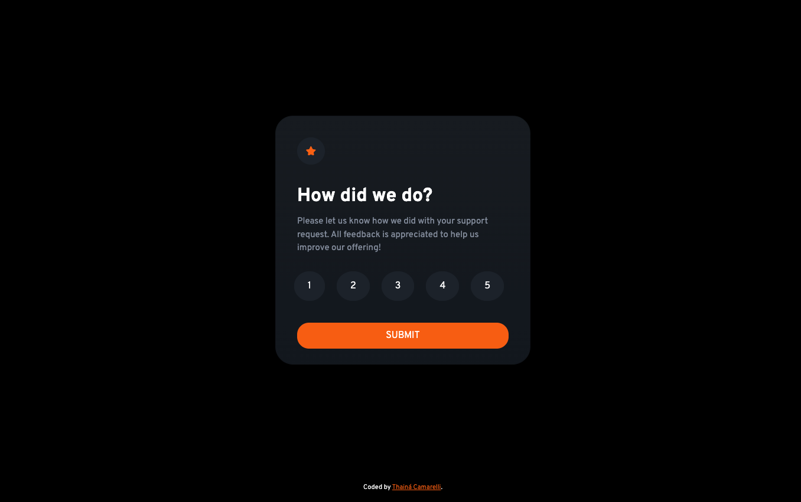
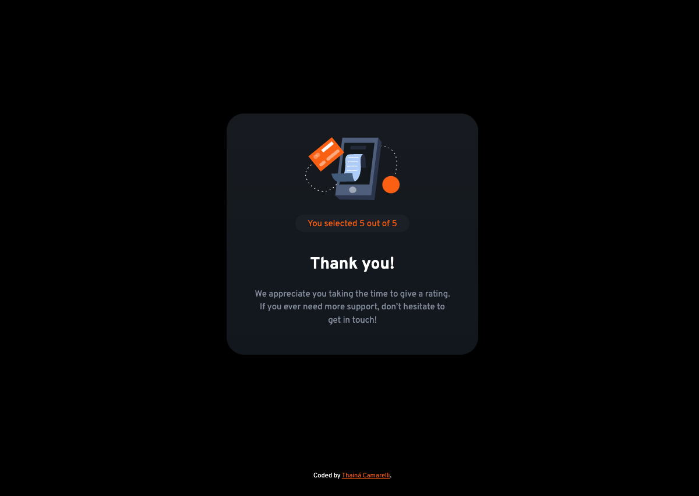

# Interactive-Component

This is a solution to the [Interactive rating component challenge on Frontend Mentor](https://www.frontendmentor.io/challenges/interactive-rating-component-koxpeBUmI/hub/interactive-rating-component-lZhDg7uZcr). Frontend Mentor challenges help you improve your coding skills by building realistic projects. 

## Table of contents

- [Overview](#overview)
  - [The challenge](#the-challenge)
  - [Screenshot](#screenshot)
  - [Links](#links)
- [My process](#my-process)
  - [Built with](#built-with)
  - [What I learned](#what-i-learned)
  - [Continued development](#continued-development)
  - [Useful resources](#useful-resources)
- [Author](#author)
- [Acknowledgments](#acknowledgments)

## Overview

### Screenshot





### Links

- Solution URL: [URL](https://thaicamarelli.github.io/Interactive-Component/)

## My process

### Built with

- Semantic HTML5 markup
- CSS custom properties
- Flexbox
- JS

### What I learned

```css
.card-style{
    background: linear-gradient(180deg, rgb(30, 36, 43) 0%, rgb(23, 30, 40) 100%);
}
```
```JS
document.querySelector(".thankyou-div").style.display = "none"

```

## Author

- Frontend Mentor - [@thaicamarelli](https://www.frontendmentor.io/profile/thaicamarelli)